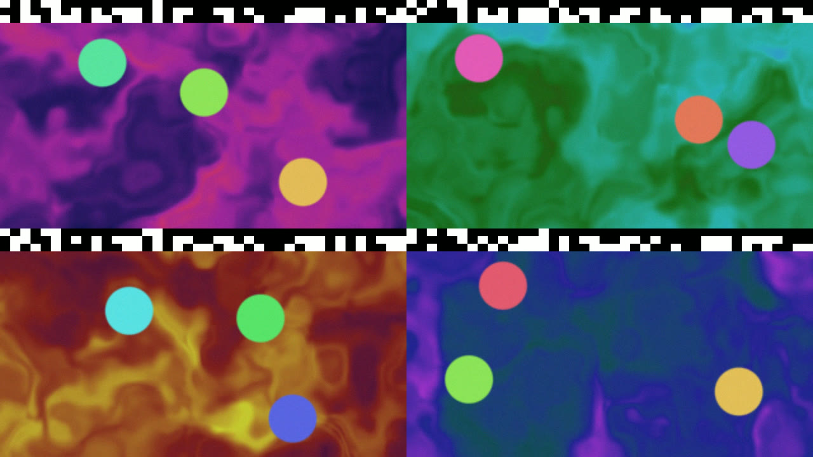
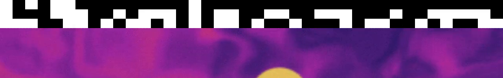
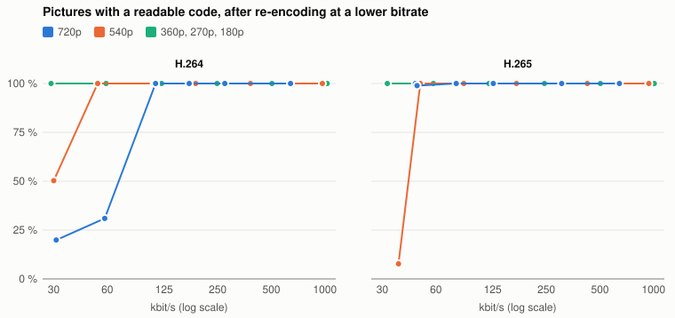
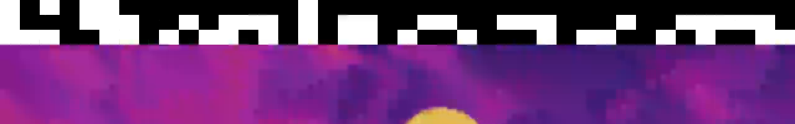
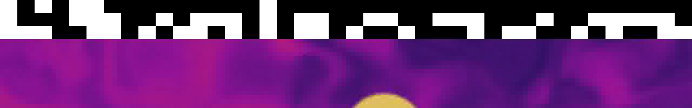
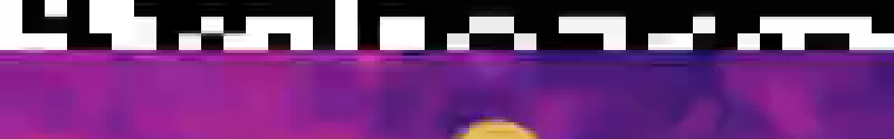
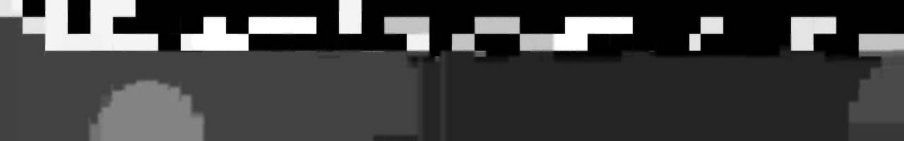
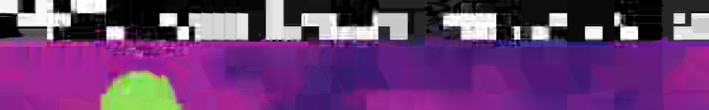

# camfarm

Synthetic RTSP cameras with ground truth in every picture, and a reader that checks every frame at the far end of
a video pipeline.

- **camfarm** runs N cameras on one machine. Each camera renders its pictures on the GPU, stamps every picture with
  its camera id, frame number and capture time, hardware-encodes it (H.264, H.265 or MJPEG) and serves it over RTSP
  at an exact frame rate.
- **camcheck** reads the pictures back, from RTSP directly, from GStreamer CUDA IPC exports, or from a recorded
  video with the cameras tiled in a grid. Per camera it reports frames delivered, lost, repeated, out of order and
  unreadable, and the latency from capture to arrival.
- **framecode** is the picture code: a pure Rust library with no dependencies.

Use it to test camera ingest, transcoding and composition pipelines with realistic, verifiable input: you know every
frame that was produced, so you can tell exactly what the pipeline delivered and how late.



*Four cameras from one camfarm instance. Every camera has its own colours and motion; the black and white band at
the top of each picture is the frame code.*

## The frame code

The top tenth of every picture is a band of 3 x 40 black or white cells. Cell size follows the picture size
(width / 40, height / 30), so the code survives scaling and lossy coding; each cell is read as the mean of its
central half.

| cells    | content                                                   |
|----------|-----------------------------------------------------------|
| 0..8     | sync pattern 10101100 (also the black/white reference)     |
| 8..16    | camera id                                                 |
| 16..48   | frame number                                              |
| 48..96   | capture time, microseconds since the Unix epoch, low 48 bits |
| 96..112  | CRC-16/CCITT-FALSE of the payload                         |
| 112..120 | sync pattern 01010011                                     |



A reader takes the mean of the central half of each cell, sets the threshold halfway between the black and white
sync cells, and accepts the picture only if both sync patterns match and the CRC is right. Anything else counts as
unreadable, never as a wrong frame.

Below the band: an animated noise field, drifting discs and per-pixel white noise. `--noise` sets the white noise
amplitude, which decides how many bits an encoder needs.

## How the code survives compression

To test this, one camera was recorded (12 s, 181 pictures, 1280x720 at 15 fps). The recording was then re-encoded
at five sizes, with H.264 and H.265 from 1000 kbit/s down to 30 kbit/s and MJPEG from quality 2 down to 31, and every
picture was read back with `camcheck grid`.



- **H.264:** at 720p, every picture is readable down to about 110 kbit/s. At 540p, every picture is readable down to
  about 50 kbit/s.
- **H.265:** at 720p, every picture is readable at 46 kbit/s; the encoder would not go lower, and at its lowest
  setting 179 of 181 pictures were readable. At 540p, every picture is readable down to about 50 kbit/s.
- **360p and smaller (cells down to 8 x 6 pixels):** every picture is readable at every bitrate tested, down to
  30 kbit/s.
- **MJPEG:** every picture is readable at every quality and size, including quality 31.
- **Wrong reads:** none. Every picture camcheck accepted carried the right camera id. Damaged pictures fail the sync
  or CRC check and are counted as unreadable.

Blur and ringing do not break the code. It fails when the rate control runs out of bits, stops updating parts of
the picture, and leaves cells from an earlier frame behind:

| code band | result |
|---|---|
|  | 720p H.264, 113 kbit/s: readable |
|  | 720p MJPEG, quality 31: readable |
|  | 180p H.264, 32 kbit/s (enlarged): readable |
|  | 720p H.264, 57 kbit/s: half-updated cells, rejected by the CRC |
|  | 540p H.265, 38 kbit/s (enlarged): stale and smeared cells, rejected |

A real 720p camera stream runs at 1-15 Mbit/s, ten to a hundred times above where the code starts to fail. A
pipeline that scales cameras down to small tiles before encoding also keeps the code readable. The re-encodes used
ffmpeg's libx264 and libx265 (preset medium, constant bitrate with a 1 s buffer, no B-frames). Other encoders will
differ, so run [docs/robustness.sh](docs/robustness.sh) on a recording of your own; it writes
[docs/robustness.csv](docs/robustness.csv), and [docs/robustness_chart.py](docs/robustness_chart.py) draws the
chart.

## Install

Download a release for your platform from the [releases page](https://github.com/torkeldanielsson/camfarm/releases):

| archive | for |
|---|---|
| `camfarm-<version>-x86_64-ubuntu24.04.tar.gz` | Ubuntu 24.04 on x86_64 |
| `camfarm-<version>-aarch64-ubuntu24.04.tar.gz` | NVIDIA Jetson with JetPack 7 (and other arm64 Ubuntu 24.04) |
| `camfarm-<version>-aarch64-ubuntu22.04.tar.gz` | NVIDIA Jetson with JetPack 6 (and other arm64 Ubuntu 22.04) |

Runtime packages:

```sh
sudo apt install gstreamer1.0-plugins-base gstreamer1.0-plugins-good gstreamer1.0-plugins-bad \
    gstreamer1.0-libav libgstrtspserver-1.0-0
```

camfarm also needs a Vulkan driver (NVIDIA drivers and JetPack include one). On Jetson the hardware encoders
(`nvv4l2h264enc`, `nvv4l2h265enc`, `nvjpegenc`) come with JetPack.

### Build from source

```sh
sudo apt install build-essential pkg-config libgstreamer1.0-dev libgstreamer-plugins-base1.0-dev \
    libgstreamer-plugins-bad1.0-dev libgstrtspserver-1.0-dev
cargo build --release
```

## camfarm

```sh
# 32 cameras, 1280x720 at 15 fps, H.264 at 2 Mbit/s, phases spread over the frame period
camfarm --cameras 32 --width 1280 --height 720 --fps 15 --codec h264 --bitrate-kbps 2000
# rtsp://<host>:8554/cam01 ... cam32
```

| option | meaning |
|---|---|
| `--cameras N`, `--first-id K` | camera count and the id of the first one (use different ranges on several machines) |
| `--width`, `--height`, `--fps` | picture size and frame rate |
| `--codec h264\|h265\|mjpeg` | camera codec |
| `--bitrate-kbps`, `--vbr`, `--gop-s` | rate control (CBR by default) and key-frame interval |
| `--jpeg-quality` | MJPEG quality |
| `--noise` | white noise amplitude in luma levels; raise it for high bitrates |
| `--phase spread\|random\|aligned` | when each camera captures within the frame period |
| `--encoder auto\|jetson\|nvcodec\|software` | encoder elements (auto picks Jetson, then NVIDIA desktop, then software) |
| `--onvif` | add the ONVIF replay RTP header extension (NTP capture time per frame), like Axis `onvifreplayext=1` |
| `--port`, `--mount-prefix` | RTSP port (8554) and mount names (`cam`) |

Frame n of a camera is handed to its encoder at exactly `t0 + phase + n / fps`; that instant is the capture time in
the code. Every camera has its own RTSP media and UDP sockets.

Capacity notes:

- A Jetson AGX Orin (MAXN, `jetson_clocks`) serves 32 x 720p15 at up to ~8 Mbit/s. Its single video encoder is the
  limit: 32 x 720p15 at 15 Mbit/s or 24 x 1080p15 at 8 Mbit/s saturate it. Check with `tegrastats` and verify the
  cameras with camcheck.
- NVIDIA desktop GPUs allow a limited number of concurrent NVENC sessions (12 on a GeForce RTX 4070 with driver 610).
- Software encoding needs `gstreamer1.0-plugins-ugly` (x264) and `gstreamer1.0-plugins-bad` (x265).

## camcheck

```sh
# Verify the cameras themselves (run it on a machine on the same switch as the cameras)
camcheck rtsp --url-base rtsp://192.0.2.10:8554/cam --count 32 --seconds 60

# Check what a pipeline hands out as GStreamer CUDA IPC exports (cudaipcsink sockets /tmp/cam01 ... /tmp/cam32)
camcheck cuda-ipc --path-base /tmp/cam --count 32 --seconds 60 --csv frames.csv --json summary.json

# Check a recorded composed stream with the cameras in an 8-column grid of 960x540 cells
camcheck grid --file recording.h265 --count 32 --cols 8 --cell-w 960 --cell-h 540
```

Output, per camera and in total: received fps, distinct camera frames, lost (gaps in the frame numbers), repeated,
backwards (an older picture after a newer one), unreadable, wrong camera, delivered %, and latency median / p95.
Latency is arrival minus the capture time in the code, so the camera machine and the checking machine need
synchronized clocks (NTP or PTP); with chrony on a LAN expect well under a millisecond of error.

`cuda-ipc` copies only the code band rows out of each picture in GPU memory; it needs the NVIDIA driver and
GStreamer's CUDA library (GStreamer >= 1.24 for `cudaipcsrc`). All cameras are read in one pipeline, so they share
one CUDA context.

## Testing a pipeline end to end

1. **Start the cameras** on the camera machine: `camfarm --cameras 32 ...` (see above). It prints one URL per camera
   and, every few seconds, how many frames it pushed late or skipped. Both counts should stay at 0.
2. **Check the cameras on their own.** From a machine on the same switch as the camera machine, run
   `camcheck rtsp --url-base rtsp://<camera host>:8554/cam --count 32 --seconds 60`. Expect 100.000 % delivered and
   nothing lost. If this check fails, fix the cameras or the network first; nothing downstream can be judged until it
   passes.
3. **Point the pipeline under test at the cameras**, at `rtsp://<camera host>:8554/cam01` and so on.
4. **Check what the pipeline delivers**, at the far end:
   - Use `camcheck cuda-ipc` when the pipeline hands out GStreamer CUDA IPC textures.
   - Use `camcheck rtsp` when it serves RTSP again.
   - Use `camcheck grid` on a recording when it composes the cameras into one video.
5. **Read the result.** A clean run looks like this:

```text
 cam     fps distinct   lost   rep   back unread  wrong  deliv%   lat med   lat p95
   1   15.00      300      0     0      0      0      0  100.00      22.9      23.4
   2   15.00      300      0     0      0      0      0  100.00      22.9      23.3
   ...
ALL: 4 cameras, distinct 1200 of 1200 camera frames (100.000 %), lost 0, repeated 0, backwards 0, unreadable 0, wrong camera 0, latency median 22.9 ms p95 23.3 ms, worst camera 100.00 %
```

What the columns mean:

- `lost`: frame numbers that never arrived.
- `rep`: the same frame handed out again, as happens when a pipeline holds the last picture.
- `back`: an older frame arriving after a newer one.
- `unread`: pictures whose code could not be read.
- `wrong`: a picture from another camera in this camera's slot.
- `lat`: arrival time minus capture time.

Frames lost in step 4 but not in step 2 were lost in the pipeline, or in the network between the camera machine and
the pipeline. `--csv` writes one row per picture (camera, arrival time, frame number, capture time, read error) for
your own analysis, and `--json` writes the summary.

## Testing advice

- Line-rate bursts (a large frame leaving a sender at 1 Gbit/s) can be dropped by switches with small buffers where
  traffic merges onto a 1 Gbit/s link, without any counter showing it. If a pipeline loses frames, test the network
  path on its own.

## License

MIT, see [LICENSE](LICENSE).
